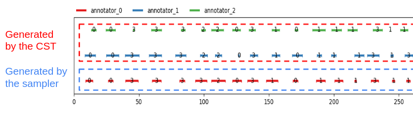

========
How-to's
========

This section will explain how to make the most of ``pygamma-agreement``'s customization possibilities.

Setting up your own positional dissimilarity
~~~~~~~~~~~~~~~~~~~~~~~~~~~~~~~~~~~~~~~~~~~~

The only positionnal dissimilarity available in ``pygamma-agreement`` is the *Positional Sporadic dissimilarity*,
introduced by [mathet2015]_. In this part, we'll detail how to use your own for computing the gamma agreement.

A ``Dissimilarity`` class is a class that holds the information needed to **compile** a dissimilarity function.
It is made this way to optimize as much as possible the very costly computation of gamma. Let's start by
**inheriting** the ``AbstractDissimilarity`` class :

.. code-block:: python

    from pygamma_agreement import AbstractDissimilarity, Unit
    import numpy as np
    from typing import Callable

    class MyPositionalDissimilarity(AbstractDissimilarity):
        def __init__(self, delta_empty=1.0):
            super().__init__(delta_empty=delta_empty)

        # Abstract methods overrides
        def compile_d_mat(self) -> Callable[[np.ndarray, np.ndarray], float]:
            ...

        def d(self, unit1: Unit, unit2: Unit) -> float:
            ...

This is essentially the minimum skeleton needed to define a new positional dissimilarity. You can also use additionnal
attributes to make your dissimilarity more parametrizable.

For this example, the dissimilarity we'll be implementing will be defined as such : for an integer :math:`p`,

.. math::

    d_p(u, v) = (|start(u) - start(v)|^p + |end(u) - end(v)|^p)^{\frac{1}{p}} \times \Delta_{\emptyset}

.. math::

    d_p(u_{\emptyset}, u) = d_p(u, u_{\emptyset}) = \Delta_{\emptyset}

thus, let's redefine the constructor accordingly :

.. code-block:: python

    def __init__(self, p: int, delta_empty=1.0):
            self.p = p
            assert p > 0
            super().__init__(delta_empty=delta_empty)

Great. Now, let's explain what the ``d`` method is.

The ``AbstractDissimilarity.d`` method is essentially the python method that returns the dissimilarity between the two
non-empty given units. When the units are empty, any algorithm from ``pygamma-agreement`` that uses a dissimilarity
object will do the checking out of this method and use the ``delta_empty`` attribute accordingly.

So, you only have to implement the first part of :math:`d_p`'s definition.

.. code-block:: python

    def d(self, unit1: Unit, unit2: Unit) -> float:
        return ( abs(unit1.segment.start - unit2.segment.start)**self.p
                 + abs(unit1.segment.end - unit2.segment.end)**self.p ) ** (1/self.p)

This method is essentially used in the gamma-cat computation, since it is too slow for the costly gamma algorithm.

It's time to explain the essential part of the dissimilarity : the ``compile_d_mat`` method.
To minimize computation time of the gamma-agreement, the dissimilarities are used in a C-compiled form
generated by the ``numba`` library. To accomplish this, they need to keep the same signature, and to
only use native python or ``numpy`` types/operations internally.

Let's write the ``MyPositionalDissimilarity.compile_d_mat`` method to better explain it :

.. code-block:: python

    def compile_d_mat(self) -> Callable[[np.ndarray, np.ndarray], float]:
        # Calling self inside d_mat makes the compiler choke, so you need to copy attributes in locals.
        p = self.p
        delta_empty = self.delta_empty
        from pygamma_agreement import dissimilarity_dec

        @dissimilarity_dec  # This decorator specifies that this function will be compiled.
        def d_mat(unit1: np.ndarray, unit2: np.ndarray) -> float:
            # We're in numba environment here, which means that only python/numpy types and operations will work.
            return (abs(unit1[0] - unit2[0])**p
                    + abs(unit1[1] - unit2[1])**p)**(1 / p) * delta_empty

        return d_mat

You'll notice that the units' attributes are accessed by index. The correspondance is the following :

.. code-block:: python

    unit_array: np.ndarray
    unit_object: Unit

    unit_array[0] == unit_object.segment.start
    unit_array[1] == unit_object.segment.end
    unit_array[2] == unit_object.segment.end - unit_object.segment.start

Now, the dissimilarity is ready to be used !

.. code-block:: python

    from pygamma_agreement import Continuum
    continuum: Continuum
    dissim = MyPositionalDissimilarity(p=2, delta_empty=1.0)
    gamma_results = continuum.compute_gamma(dissim)

.. warning::

    A very important thing to note is that the structure of dissimilarities is not really compatible with changing
    attributes, because of the class structure and of compilation. It is advised do **redefine** your dissimilarities if
    you want to change attributes.

    .. code-block:: python

        dissim.p = 3 # DON'T do that !
        dissim = MyPositionalDissimilarity(p=3, delta_empty=1.0) # Redefine it instead.

Setting up your own categorical dissimilarity
~~~~~~~~~~~~~~~~~~~~~~~~~~~~~~~~~~~~~~~~~~~~~

For many reasons,  string types are not easy to manipulate in ``numba`` ``njit``'ed code.
Instead, category-to-category dissimilarities are pre-computed at the python level. Thus, there is a very simple
interface avaible : You just need to inherit the ``LambdaCategoricalDissimilarity``, and override the
``cat_dissim_func`` static method :

.. code-block:: python

    class MyCategoricalDissimilarity(LambdaCategoricalDissimilarity):
    # Precomputation requires the category labels to be saved. Don't use this dissimilarity with
    # a continuum containing unspecified categories
    def __init__(self, labels: Iterable[str], delta_empty: float = 1.0):
        super().__init__(labels, delta_empty)

    @staticmethod
    def cat_dissim_func(str1: str, str2: str) -> float:
        return ...  # Your categorical dissimilarity function. Results should be in [0, 1]

Beware that in reality, the resulting dissimilarity between categories ``a`` and ``b`` will be
``cat_dissim_func(a, b) * delta_empty``

Your new categorical dissimilarity is now ready. You can, for instance, use it in a combined categorical dissimilarity :

.. code-block:: python

    from pygamma_agreement import CombinedCategoricalDissimilarity, Continuum

    continuum: Continuum
    dissim = CombinedCategoricalDissimilarity(alpha=3, beta=1,
                                              cat_dissim=MyCategoricalDissimilarity(continuum.categories))
    gamma_results = continuum.compute_gamma(dissim)

Combining dissimilarities
~~~~~~~~~~~~~~~~~~~~~~~~~

The only combined dissimilarity (a dissmilarity that considers both positionning and categorizing of units)
natively available in ``pygamma-agreement`` is the one introduced by [mathet2015]_
(the ``CombinedCategoricalDissimilarity``):

.. math::

    d_{\alpha, \beta}(u, v) = \alpha d_{pos}(u, v) + \beta d_{cat}(u, v)

.. math::

    d_{\alpha, \beta}(u_{\emptyset}, u) = d_{\alpha, \beta}(u, u_{\emptyset}) = \Delta_{\emptyset}

Imagine instead that you want to adapt this this dissimilarity geometrically :

.. math::

    d_{\alpha, \beta}(u, v) = d_{pos}(u, v)^{\alpha} \times d_{cat}(u, v)^{\beta}

.. math::

    d_{\alpha, \beta}(u_{\emptyset}, u) = d_{\alpha, \beta}(u, u_{\emptyset}) = \Delta_{\emptyset}

Let's start by using the same skeleton as for a simple positional dissimilarity :

.. code-block:: python

    from pygamma_agreement import AbstractDissimilarity, Unit
    import numpy as np
    from typing import Callable

    class MyCombinedDissimilarity(AbstractDissimilarity):
        def __init__(self, alpha: float, beta: float,
                     pos_dissim: AbstractDissimilarity,
                     cat_dissim: CategoricalDissimilarity,
                     delta_empty=1.0):
            self.alpha, self.beta = alpha, beta
            self.pos_dissim, self.cat_dissim = pos_dissim, cat_dissim
            super().__init__(cat_dissim.categories, delta_empty=delta_empty)

        # Abstract methods overrides
        def compile_d_mat(self) -> Callable[[np.ndarray, np.ndarray], float]:
            ...

        def d(self, unit1: Unit, unit2: Unit) -> float:
            ...

.. note::

    One important thing to note that if your dissimilarity takes categories into account, you **must** specify a set
    of categories to the super constructor. Here in this example, the cat_dissim part does take it into account, so
    its categories can be obtained directly.

The ``d`` method can simply make use of the other dissimilarities' ``d`` s :

.. code-block::

    def d(self, unit1: Unit, unit2: Unit) -> float:
            return ( self.pos_dissim.d(unit1, unit2)**(self.alpha)
                     * self.cat_dissim.d(unit1, unit2)**(self.beta) )

Moreover, you can access a dissimilarity's ``numba``-compiled function from the ``d_mat`` attribute, which is
usable in ``numba``-compiled environment. Thus, compiling the dissimilarity function is pretty simple, and very
similar to a simple dissimilarity with only arithmetic operations. Let's illustrate this :

.. code-block:: python

    def compile_d_mat(self) -> Callable[[np.ndarray, np.ndarray], float]:
            alpha, beta = self.alpha, self.beta
            pos, cat = self.pos_dissim.d_mat, self.cat_dissim.d_mat
            # d_mat attribute contains the numba-compiled function

            from pygamma_agreement import dissimilarity_dec
            @dissimilarity_dec
            def d_mat(unit1: np.ndarray, unit2: np.ndarray) -> float:
                return pos(unit1, unit2)**alpha * cat(unit1, unit2)**beta

            return d_mat

Then, there's only the ``d`` method left to code.

.. code-block:: python

    def d(self, unit1: Unit, unit2: Unit):
        return (self.pos_dissim.d(unit1, unit2)**self.alpha *
                self.cat_dissim.d(unit1, unit2)**self.beta)

And that's it ! Now, in theory, you have all the tools you need to compute the gamma-agreement with any dissimilarity.

.. code-block:: python

    continuum: Continuum
    dissim = MyCombinedDissimilarity(alpha=3, beta=2,
                                     pos_dissim=MyPositionalDissimilarity(),
                                     cat_dissim=MyCategoricalDissimilarity(continuum.categories))
    gamma_results = continuum.compute_gamma(dissim)

Generating random continua for comparison using the Statistical Sampler and the Corpus Shuffling Tool
~~~~~~~~~~~~~~~~~~~~~~~~~~~~~~~~~~~~~~~~~~~~~~~~~~~~~~~~~~~~~~~~~~~~~~~~~~~~~~~~~~~~~~~~~~~~~~~~~~~~~

If you want to measure your dissimilarity's influence on the gamma-agreement depending on
certain possible errors between annotations, ``pygamma-agreement`` contains all the the needed tools :
the ``StatisticalContinuumSampler``, which generates totally random continuua, and the
``CorpusShufflingTool``, that simulates errors when annotating a resource.

First, let's generate a random reference for the corpus shuffling tool, which will act as the perfectly accurate
annotation:

.. code-block:: python

    from pygamma_agreement import StatisticalContinuumSampler, CorpusShufflingTool, Continuum

    sampler = StatisticalContinuumSampler()
    # avg stands for average, std stands for standart deviation. All values are generated using normal distribution.
    sampler.init_sampling_custom(["annotator_ref"],
                                 avg_num_units_per_annotator=50, std_num_units_per_annotator=10,
                                 avg_duration=15, std_duration=3,
                                 avg_gap=5, std_gap=1,
                                 categories=["Speaker1", "Speaker2", "Speaker3"],
                                 categories_weight=[0.5, 0.3, 0.2])  # Proportions of annotations per speaker
    reference_continuum: Continuum = sampler.sample_from_continuum

You could also measure the behavior of the gamma with your dissimilarity by tweaking the values in the sampler.
Now, let's use the corpus shuffling tool to generate a continuum with several annotators, with the selected errors
with a given magnitude :math:`m`:

.. code-block:: python

    cst = CorpusShufflingTool(magnitude=m,  # m is a float in [0, 1]
                              reference_continuum=reference_continuum)
    generated_continuum: Continuum = cst.corpus_shuffle(
                                         ["Annotator1", "Annotator2", "Annotator3"],
                                         shift=True,  # annotations are randomly translated proportionally to m
                                         false_pos=True,  # random annotations are added, amount propotional to m
                                         false_neg=True,  # random annotations are discarded, amount propotional to m
                                         split=True,  # segments are splitted in two, number of splits propotional to m
                                         cat_shuffle=True,  # annotation categories are changed, amount propotional to m
                                         include_ref=False) # If true, copies the reference's annotations.

Now you have a beautiful continuum, ready to be worked on !

.. code-block:: python

    dissim: AbstractDissimilarity
    gamma_results = generated_continuum.compute_gamma(dissim)

Beware that a lot of randomness is involved in gamma computation and continuum generation, so you might want to seed
using ``np.seed`` if you're making graphs. Averaging several values computed from continua generated with the same
parameters might be better too.

..  [mathet2015] Yann Mathet et Al.
    The Unified and Holistic Method Gamma (γ) for Inter-Annotator Agreement
    Measure and Alignment (Yann Mathet, Antoine Widlöcher, Jean-Philippe Métivier)

