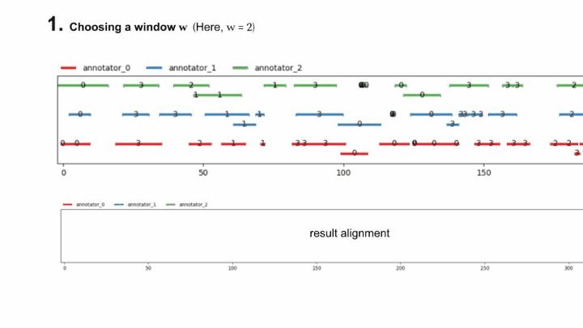
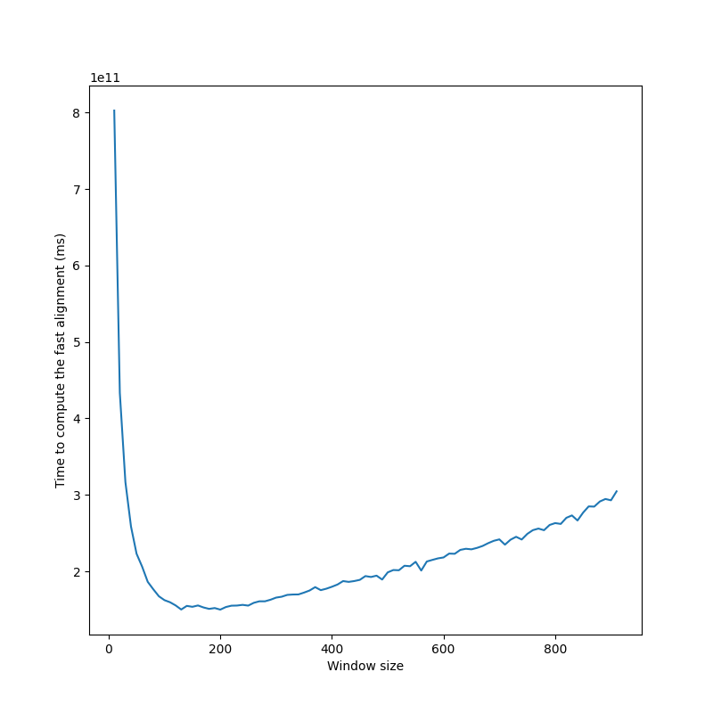
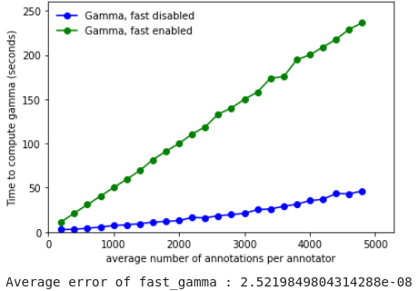
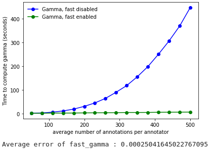

===========
Performance
===========

This section aims to describe and explain the performances of the ``pygamma-agreement``
library in terms of time and memory usage.

Computational complexity
~~~~~~~~~~~~~~~~~~~~~~~~
For a continuum with :

- :math:`p` annotators
- :math:`n` annotations per annotator
- :math:`N` random samples involved (depends on the required precision)

The computational complexity of ``Continuum.compute_gamma()`` is :

.. math::

    C(N, n, p) = O(N \times n^p)

We're aware that for a high amount of annotators, the computation
takes a lot of time and cannot be viable for realistic input.

The theorical complexity cannot be reduced, however we have found a :ref:`workaround <fast_option>` that sacrifices
precision for a **significant** gain in complexity.

Moreover, the computation of the sample's dissimilarity is parellelized, which means
that the complexity can be reduced to at best :math:`O(s \times N \times n^p / c)`
with :math:`c` CPUs.

.. _fast_option:

Fast option
~~~~~~~~~~~

The ``Continuum.compute_gamma()`` method allows to set the *"fast"* option, which uses a different algorithm
for determining the best alignment of a disorder. Although there is no found theory to back the precision of the algorithm,
we have found out that it gives the **exact** results for the best alignments for real data, and a good approximation
with continua generated specifically to mess with the algorithm.

Let's explain how this works with the notations of [mathet2015]_. The algorithm creates an alignment recursively,
each time eliminating a certain number of units in the continuum : for :math:`\mathcal{U}` a set of units, :math:`\mathcal{A}` the set
of annotators, :math:`d` a dissimilarity, :math:`\mathcal{U} \mathcal{A}` the set of unitary alignments of
:math:`\mathcal{U}` and :math:`\mathcal{U} \mathcal{A}_u` the set of unitary alignments of :math:`\mathcal{U}` containing :math:`u \in \mathcal{U}` :

- Let :math:`\breve{a}(\mathcal{U})` be any one of its best alignments.
- For :math:`x` a real number, let :math:`\mathcal{U}[x] = \{u \in \mathcal{U} \mid end(u) \leqslant x\}`.
- For :math:`w` an integer, let
  :math:`\mathcal{U}_w = \mathcal{U}[min\{x \mid |\mathcal{U}[x]| \geqslant w \times |\mathcal{A}| \}]`,
  the "Head of size :math:`w` of :math:`\mathcal{U}`".
- For :math:`w` an integer, let
  :math:`\epsilon_w(\mathcal{U}) = \{ u \in \mathcal{U} \mid \exists u' \in \mathcal{U}_w, d(u, u') \leq \Delta_{\emptyset} |\mathcal{A}| \}`
  and :math:`\mathcal{U}_w^+ = \mathcal{U}_w \cup \epsilon_w(\mathcal{U})`, the "extended head of size :math:`w` of :math:`\mathcal{U}`".

Then, let us define the windowed best alignment of size :math:`w` of :math:`\mathcal{U}`
(:math:`\mathcal{U} \mathcal{A}` being the set of unitary alignments of :math:`\mathcal{U}`) :

.. math::

    \breve{a}_w(\mathcal{U}) = \breve{a}(\mathcal{U}_w^+) \cap  \mathcal{U}_w \mathcal{A}

Finally, we can define the "fast alignment of window :math:`w`" :math:`\breve{\alpha}_w(\mathcal{U})` recursively :

.. math::
    \breve{f}_w(\emptyset) = \emptyset

.. math::
    \breve{f}_w(\mathcal{U}) = \breve{a}_w(\mathcal{U}) \cup \breve{f}_w(\mathcal{U} \setminus \{u \in \mathcal{U} \mid
    \exists \bar{a} \in \breve{a}_w(\mathcal{U}), \bar{a} \in \mathcal{U}\mathcal{A}_u  \})

To clarify, here is an animation of how the "fast-alignment" is found :

The fast-gamma is simply the gamma with the best alignment of a each continuum (input and samples) replaced by the fast
alignment with a certain window size.

To put words onto the fast-alignment algorithm, it consists of computing the windowed best alignment of size :math:`w` of the
continuum (using the classical MIP method), saving its unitary alignments & discarding the units saved from the continuum,
and doing it again until the continuum is empty.

It uses the fact that alignments are made using locality of annotations, so it is only precise with a dissimilarity that
mainly takes positionning into account. Results are still good with a combined categorical dissimilarity where
:math:`\alpha = 2 \times \beta`, and the window size doesn't seem to affect precision.

The fast gamma algorithm uses some sort of *"windowing"* of the continuum, and we have determined an approximation of
its computational complexity, with :math:`w` the number of annotation per annotator in a window :

.. math::

    C(w, N, n, p) = N \times (\frac{n}{w} \times (\lambda \times (w + s)^p + D(n, p, w, s))

With :

- :math:`D` an additional complexity per window that we will not detail here.
- :math:`\lambda` the *"numba factor"*, i.e the gain of speed obtained by using compiled numba functions, that we have
  estimated.
- :math:`s` the *"additionnal window size"*, which is higher when the continuum has lots of overlapping.

This becomes a lot more interesting when the amount of annotations grows. One important thing to notice is that
this complexity can be minimized with the right window size.

  **This is the look of the time to compute fast-gamma depending on the size of the windows**. Thus, before
  starting to compute fast-gamma, the algorithm determines the optimal window size by sampling the complexity
  function.

Here are the performance comparisons between the two algorithms :

  **2 annotators**

  **3 annotators**

As demonstrated, the gain in computation time provided by the `fast-gamma`
optimization is very interesting, and the precision is more than
sufficient, so we strongly advise to use the `fast-gamma` at all times.

So far, we haven't found a proof that the value given by the fast-gamma algorithm is precise.

**However, we also haven't managed to find a case where the inaccuracy is significant.**

Thus, for real (i.e. natural) input, it is established from experience that fast-gamma is more than reliable :
it is advised to prioritize it since the gain in computing time is significant.

..  [mathet2015] Yann Mathet et Al.
    The Unified and Holistic Method Gamma (γ) for Inter-Annotator Agreement
    Measure and Alignment (Yann Mathet, Antoine Widlöcher, Jean-Philippe Métivier)