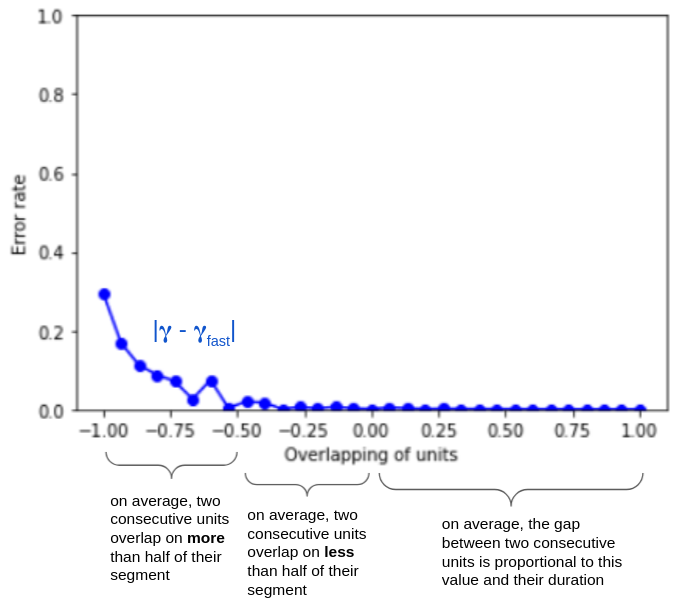

===========
Performance
===========

This section aims to describe and explain the performances of the ``pygamma-agreement``
library in terms of time and memory usage.

Computational complexity
~~~~~~~~~~~~~~~~~~~~~~~~
For a continuum with :

- :math:`p` annotators
- :math:`n` annotations per annotator
- :math:`N` random samples involved (depends on the required precision)

The computational complexity of ``Continuum.compute_gamma()`` is :

.. math::

    C(N, n, p) = O(s \times N \times n^p)

The factor :math:`s` depends on the continuum, for instance, lots of overlapping of annotations
means a higher factor. We're aware that for a high amount of annotators, the computation
takes a lot of time and cannot be viable for realistic input.

The theorical complexity cannot be reduced, however we have found a :ref:`workaround <fast_option>` that sacrifices
precision for a **significant** gain in complexity.

Moreover, the computation of the sample's dissimilarity is parellelized, which means
that the complexity can be reduced to at best :math:`O(s \times N \times n^p / c)`
with :math:`c` CPUs.

.. _fast_option:

Fast option
~~~~~~~~~~~

The ``Continuum.compute_gamma()`` method allows to set the *"fast"* option, which uses a different algorithm
for determining the best alignment of a disorder. Although there is no theory to back the precision of the algorithm,
we have found out that it gives the **exact** results for the best alignments for real data, and a good approximation
with continua generated specifically to mess with the algorithm.

It uses the fact that alignments are made using locality of annotations, so it is only precise with a dissimilarity that
mainly takes positionning into account. Results are still good with a combined categorical dissimilarity where
math:`\alpha = 2 \times \beta`.

Here are the performance comparisons between the two algorithms :

.. figure:: images/time2annotators.png
  :scale: 70%
  :alt: time to compute gamma (8 CPUs, 2 annotators)
  :align: right

  **2 annotators**

.. figure:: images/time3annotators.png
  :scale: 70%
  :alt: time to compute gamma (8 CPUs, 3 annotators)
  :align: left

  **3 annotators**

The fast gamma algorithm uses some sort of *"windowing"* of the continuum, and we have determined an approximation of
its computational complexity, with :math:`w` the number of annotation per annotator in a window :

.. math::

    C(N, n, p) = N \times (\frac{n}{w} \times (f \times (w + s)^p + D(n, p, w, s))

With :math:`D` an additional complexity per window that we will not detail here, and
:math:`f` the "numba factor", i.e the gain of speed obtained by using compiled numba functions, that we have
estimated.

This becomes a lot more interesting when the amount of annotations grows. One important thing to notice is that
this complexity can be minimized with the right window size.

.. figure:: images/windowestimation.png
  :scale: 70%
  :align: right

  **This is the look of the time to compute fast-gamma to the size of the windows**. Thus, before starting to compute
  fast-gamma, the algorithm determines the optimal window size by sampling the complexity function.

As for the precision of the fast gamma, we have not yet found a proof of its
accuracy, but we have reasons to believe that if the overlapping of the annotations from
a single annotator is limited, the fast-gamma has the exact same value as the gamma.

The algorithm used by fast-gamma assumes that for three annotation segments :math:`A`, :math:`B` and :math:`C`,
if :math:`A < B < C` (alphanumerical order), then :math:`d_{pos}(A, B) < d_pos(A, C)`. It is however not true in
general, and especially not when units overlap a lot.

This is confirmed in some extent by measures :

Here's an explanation of what the overlapping value means on average :

- **-1**: two consecutive annotations from the same annotator are completely overlapped.
- **0**: there is no gap between two consecutive annotations from the same annotator.
- **1**: the gap between two consecutive annotations from the same annotator is equal to their
  length.

For real input though, it is established from experience that fast-gamma is more than reliable. Thus, it is advised to
prioritize it since the gain in computing time is signficant.

Memory usage
~~~~~~~~~~~~

Additionnaly to computing time, the memory usage's growth of the classical gamma algorithm can be problematic. For
instance, with 2 annotators each with 7000 annotations, a 8GB memory has trouble handling it.

It is advised to use fast-gamma, whose memory usage is very low in comparison, when memory starts to overflow.
As memory usage is very difficult to measure & predict, we have unfortunately not found a way to automatically
handle this.

