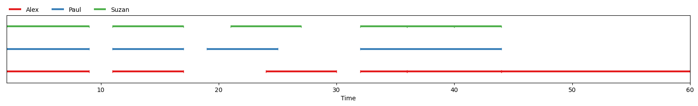
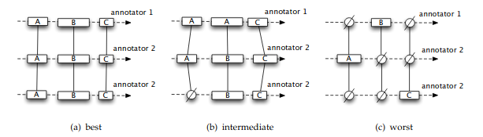

==========
Principles
==========

`pygamma-agreement` provides a set of classes that can be used to compute the γ-agreement measure on
different sets of annotation data and in different ways. What follows is a detailed
explanation of how these classes can be built and used together.

.. warning::

  A great part of this page is just a rehash of concepts that are explained
  in a much clearer and more detailed way in the original γ-agreement paper  [mathet2015]_.
  This documentation is mainly aimed at giving the reader a better understanding of our API's core
  principles.
  If you want a deeper understanding of the gamma agreement, we strongly advise that
  you take a look at this paper.

.. _units:

Units
~~~~~

A **unit** is an object that is defined in time (meaning, it has a starting point and an ending point),
and might bear an annotation. In our case, the only supported type of annotation is a category.
In `pygamma-agreement`, for all basic usages, ``Unit`` objects are built automatically when
you add an annotation to :ref:`a continuum <continua>` .
You might however have to create ``Unit`` objects if you want to create your own :ref:`alignments` .

.. note::

  `Unit` instances are sortable, meaning that they satisfy a total ordering.
  The ordering uses their temporal positions (starting/ending times) as a first
  parameter to order them, and if these are strictly equal, uses the alphabetical
  order to compare them. Ergo,

  .. code-block:: python

    >>> Unit(Segment(0,1), "C") < Unit(Segment(2,3), "A")
    True
    >>> Unit(Segment(0,1), "C") > Unit(Segment(0,1), "A")
    True
    >>> Unit(Segment(0,1)) < Unit(Segment(0,1), "A")
    True

.. _continua:

Continua (or Continuums)
~~~~~~~~~~~~~~~~~~~~~~~~

A **continuum** is an object that that stores the set of annotations produced by
several annotators, all referring to the same annotated file. It is equivalent to
the term `Annotated Set` used in Mathet et Al.  [mathet2015]_.
Annotations are stored as :ref:`units` , each annotator's units being stored in a sorted set.

`Continuums` are the "center piece" of our API, from which most of the work needed
to obtain gamma-agreement measures can be done. From a ``Continuum`` instance,
it's possible to compute and obtain:

- its :ref:`best alignment <best_alignments>` .
- its :ref:`gamma agreement measure <gamma_agreement>` .

You can create a continuum then add each unit one by one, by specifying the annotators of the units:

.. code-block:: python

    continnum = Continuum()

    continuum.add('annotator_a',
                  Segment(10.5, 15.2),
                  'category_1')

Continua can also be imported from CSV files with the following structure :

.. code-block::

    annotator, annotation, segment_start, segment_end

Thus, for instance:

.. code-block::

    E.G.:

    annotator_1, Marvin, 11.3, 15.6
    annotator_1, Maureen, 20, 25.7
    annotator_2, Marvin, 10, 26.3
    annotator_C, Marvin, 12.3, 14

.. code-block:: python

    continuum = Continuum.from_csv('your/continuum/file.csv')

If you're working in a Jupyter Notebook, outputting a `Continuum` instance will automatically
show you a graphical representation of that `Continuum`:

.. code-block:: ipython

 In  [mathet2015]_: continuum = Continuum.from_csv("data/PaulAlexSuzan.csv")
                   continuum

The same image can also be displayed with ``matplotlib`` by using :

.. code-block:: python

    from pygamma_agreement import show_continuum
    show_continuum(continuum, labelled=True)

.. _alignments:

Alignments, Unitary Alignments
~~~~~~~~~~~~~~~~~~~~~~~~~~~~~~

**A unitary alignment** is a tuple of `units`, each belonging to a unique annotator.
For a given `continuum` containing annotations from ``n`` different annotators,
the tuple will *have* to be of length ``n``. It represents a "match" (or the hypothesis of an agreement)
between units of different annotators. A unitary alignment can contain `empty units`,
which are "fake" (and null) annotations inserted to represent the absence of corresponding annotation
for one or more annotators.

**An alignment** is a set of `unitary alignments` that constitute a *partition*
of a continuum. This means that

* each and every unit of each annotator from the partitioned continuum can be found in the alignment
* each unit can be found once and *only* once

  Visual representations of unitary alignments taken from  [mathet2015]_ , with
  varying disorders.

For both alignments and unitary alignments, it is possible to compute a corresponding
:ref:`disorder <disorders>`. This possible via the ``compute_disorder`` method,
which takes a :ref:`dissimilarity <dissimilarities>` as an argument.
This (roughly) corresponds to the disagreement between
annotators for a given alignment or unitary alignment.

In practice, you shouldn't have to build both unitary alignments and alignments
yourself, as they are automatically constructed by a `continuum` instance's
``get_best_alignment`` method.

.. _best_alignments:

Best Alignments
---------------

For a given `continuum`, the alignment with the lowest possible disorder.
This alignment is found using a combination of 3 steps:

* the computation of the disorder for all potential unitary alignments
* a simple heuristic explained in  [mathet2015]_'s section 5.1.1 to eliminate
  a big part of those potential unitary alignments based on their disorder
* the usage of multiple optimization problem formulated as Mixed-Integer Programming (MIP)

The function that implements these 3 steps is, by far, the most compute-intensive in the
whole ``pygamma-agreement`` library. The best alignment's disorder is used to compute
the :ref:`gamma_agreement` .

.. _disorders:

Disorders
~~~~~~~~~

The disorder for either an :ref:`alignment or a unitary alignment <alignments>` corresponds to the
disagreement between its constituting units.

* the disorder between two units is directly computed using a dissimilarity.
* the disorder between units of a unitary alignment is an average of the disorder of each of its unit couples
* the disorder of an alignment is the mean of its constituting unitary alignments's disorders

What should be remembered is that a :ref:`dissimilarity <dissimilarities>` is needed
to compute the disorder of either an alignment or a unitary alignment, and that
its "raw" value alone isn't of much use but it is needed to compute the γ-agreement.

.. _dissimilarities:

Dissimilarities
~~~~~~~~~~~~~~~

A dissimilarity is a function that "tells to what degree two units should be considered as different,
taking into account such features as their positions, their annotations, or a combination of the two."  [mathet2015]_.
A dissimilarity has the following mathematical properties:

* it is positive (:math:`dissim (u,v) > 0`))
* it is symmetric ( :math:`dissim(u,v) = dissim(v,u)` )
* :math:`dissim(x,x) = 0`

Although dissimilarities do look a lot like distances (in the mathematical sense),
they don't necessarily are distances. Hence, they don't necessarily honor the
triangular inequality property.

If one of the units in the dissimilarity is the *empty unit*, its value is
:math:`\Delta_{\emptyset}`. This value is constant, and can be set as a parameter
of a dissimilarity object before it is used to compute an alignment's disorder.

Right now, there are three types of dissimilarities available :

* The positionnal sporadric dissimilarity (we will call it simply Positionnal dissimilarity)
* The categorical dissimilarity
* The combined dissimilarity

.. note::

    Although you will have to instantiate dissimilarities objects when using
    ``pygamma-agreement``, you'll never have to use them in any way other than
    just by passing it as an argument as shown beforehand.

Positional Dissimilarity
------------------------
A positional dissimilarity is used to measure the *positional* or *temporal* disagreement
between two annotated units :math:`u` and :math:`v`.

[mathet2015]_ introduces the positional sporadic dissimilarity as the reference positional dissimilarity
for the gamma-agreement. Its formula is :

.. math::
    d_{pos}(u,v) = \left(
                    \frac{\lvert start(u) - start(v) \rvert + \lvert end(u) - end(v) \rvert}
                    {(duration(u) + duration(v))}
                \right)^2 \cdot \Delta_{\emptyset}

Here's how to instanciate a ``PositionnalSporadicDissimilarity`` object :

.. code-block:: python

    from pygamma_agreement import PositionalDissimilarity
    dissim_pos = PositionalSporadicDissimilarity(delta_empty=1.0)

and that's it.
You can also use ``dissim_pos.d(unit1, unit2)`` to obtain directly the value of the dissimilarity between two units.
It is however very unlikely that one would need to use it, as this value is only needed in the very low end of the
gamma computation algorithm.

Categorical Dissimilarity
-------------------------

A categorical dissimilarity is used to measure the *categorical* disagreement
between two annotated units :math:`u` and :math:`v`.

.. math::

    d_{cat}(u,v) = dist_{cat}(cat(u), cat(v)) \cdot \Delta_{\emptyset}

In our case, the function :math:`dist_{cat}`
is computed using a simple lookup in a *categorical distance matrix* ``D``.
Let's suppose we have :math:`K` categories, this matrix will be of shape ``(K,K)``.

Here is an example of a distance matrix for 3 categories:

.. code-block:: python

    >>> D
    array([[0. , 0.5, 1. ],
           [0.5, 0. , 1. ],
           [1. , 1. , 0. ]])

To comply with the properties of a dissimilarity, the matrix has to be symmetrical,
and has to have an empty diagonal. Moreover, its values have be between 0 and 1.
By default, for two units with differing categories, :math:`d_{cat}(u,v) = 1`,
and thus the corresponding matrix is:

.. code-block:: python

    >>> D_default
    array([[0., 1., 1. ],
           [1., 0., 1. ],
           [1., 1., 0. ]])

here's how to instanciate a categorical dissimilarity:

.. code-block:: python

    D = array([[ 0.,   0.5,    1. ],
               [0.5,    0.,  0.75 ],
               [ 1.,  0.75,    0. ]])

    from pygamma_agreement import PrecomputedCategoricalDissimilarity
    from sortedcontainers import SortedSet

    categories = SortedSet(('Noun', 'Verb', 'Adj'))
    dissim_cat = PrecomputedCategoricalDissimilarity(categories,
                                                matrix=D,
                                                delta_empty=1.0)

.. warning::
    It's important to note that the index of each category in the categorical dissimilarity matrix is its index in
    **alphabetical order**. In this example, the considered dissimilarity will be:
        - :math:`dist_{cat}('Adj', 'Noun') = 0.5`
        - :math:`dist_{cat}('Adj', 'Verb') = 1.0`
        - :math:`dist_{cat}('Noun', 'Verb') = 0.75`

You can also use the default categorical dissimilarity, the ``AbsoluteCategoricalDissimilarity``;
there are also other available categorical dissimilarities, such as the ``LevenshteinCategoricalDissimilarity`` which
is based on the levenshtein distance.

.. _combined-dissim:

Combined Dissimilarity
----------------------

The combined categorical dissimilarity uses a linear combination of the two previous
*categorical* and *positional* dissimilarities. The two coefficients used to
weight the importance of each dissimilarity are :math:`\alpha` and :math:`\beta` :

.. math::

    d_{combi}^{\alpha,\beta}(u,v) = \alpha . d_{pos}(u,v) + \beta . d_{cat}(u,v)

This is the dissimilarity recommended by [mathet2015]_ for computing gamma.

It takes the same parameters as the two other dissimilarities, plus :math:`\alpha` and :math:`\beta` :

.. code-block:: python

    from pygamma_agreement import CombinedCategoricalDissimilarity, LevenshteinCategoricalDissimilarity

    categories = ['Noun', 'Verb', 'Adj']
    dissim = CombinedCategoricalDissimilarity(alpha=3,
                                              beta=1,
                                              delta_empty=1.0,
                                              pos_dissim=PositionalSporadicDissimilarity()
                                              cat_dissim=LevenshteinCategoricalDissimilarity(categories))

.. _gamma_agreement:

The Gamma (γ) agreement
~~~~~~~~~~~~~~~~~~~~~~~

The γ-agreement is a *chance-adjusted* measure of the agreement between annotators.
To be computed, it requires

* a :ref:`continuum <continua>` , containing the annotators's annotated units.
* a :ref:`dissimilarity <dissimilarities>`, to evaluate the disorder between the hypothesized
  alignments of the annotated units.

Using these two components, we can compute the :ref:`best alignment <best_alignments>` and its
disorder. Let's call this disorder :math:`\delta_{best}`.

Without getting into its details, our package implements a method of sampling random
annotations from a continuum. Using these :math:`N` sampled continuum, we can also compute a best
alignment and its subsequent disorder. Let's call these disorders :math:`\delta_{random}^i`, and the
mean of these values :math:`\delta_{random} =  \frac{\sum_i \delta_{random}^i}{N}`

The gamma agreement's formula is finally:

.. math::

    \gamma = 1 - \frac{\delta_{best}}{\delta_{random}}

Several points that should be clarified about that value:

* it is bounded by :math:`]-\infty,1]` but for most "regular" situations it should be contained within :math:`[0, 1]`
* the higher and the closer it is to 1, the more similar the annotators' annotations are.

the gamma value is computed from a ``Continuum`` object, using a given ``Dissimilarity`` object :

.. code-block:: python

     continuum = Continuum.from_csv('your/csv/file.csv')
     dissim = CombinedCategoricalDissimilarity(delta_empty=1,
                                               alpha=3,
                                               beta=1)
     gamma_results = continuum.compute_gamma(dissim,
                                             precision_level=0.02)

     print(f"gamma value is: {gamma_results.gamma}")

.. warning::
    The algorithm implemented by ``continuum.compute_gamma`` is very costly.
    An approximation of its computational complexity would be :math:`O(N \times (p_1 \times ... \times p_n))`
    where :math:`p_i` is the number of annotations for annotator :math:`i`, and :math:`N` is the number of
    samples used when computing :math:`\delta_{random}`, which grows as the ``precision_level``
    parameter gets closer to 0. If time of computation becomes too high, it is advised to lower the precision
    before anything else.

Gamma-cat (γ-cat) and Gamma-k (γ-k)
~~~~~~~~~~~~~~~~~~~~~~~~~~~~~~~~~~~~~~~~~~~~~~~~~~~~~~~
:math:`γ_{cat}` is an alternate inter-annotator agreement measure based on γ, made to evaluate the task of
categorizing pre-defined units. Just like γ, it is a *chance-adjusted* metric :

.. math::

    \gamma_{cat} = 1 - \frac{\delta_{best}^{cat}}{\delta_{random}^{cat}}

Where the disorder :math:`\delta_{cat}` of a continuum is computed using the same
:ref:`best alignment <best_alignments>` used for the γ-agreement : this disorder is basically the average
dissimilarity between pairs of non-empty :ref:`units <units>` in every :ref:`unitary alignment <alignments>`, weighted
by the possitional agreement between the units.

The :math:`γ_{cat}`-agreement can be obtained from the :ref:`GammaResults object <gamma_agreement>` easily:

.. code-block:: python

    print(f"gamma-cat value is : {gamma_results.gamma_cat} ")

:math:`γ_{k}` is another alternate agreement measure. It only differs from :math:`γ_{cat}` by the fact that it
only considers one defined category.

The :math:`γ_{k}` value for a category alse can be obtained from the :ref:`GammaResults object <gamma_agreement>`:

.. code-block:: python

    for category in continuum.categories:
        print(f"gamma-k of '{category}' is : {gamma_results.gamma_k(category)} ")

Further details about the measures and the algorithms used for computing them can be consulted in [mathet2015]_.

On a side-note, we would recomment combining gamma-cat with the alternate inter-annotator user agreement measure
**Soft-Gamma** (new measure whose idea emerged during the developpement of ``pygamma-agreement``). More information
about soft-gamma is available in the dedicated section of this documentation.

..  [mathet2015] Yann Mathet et Al.
    The Unified and Holistic Method Gamma (γ) for Inter-Annotator Agreement
    Measure and Alignment (Yann Mathet, Antoine Widlöcher, Jean-Philippe Métivier)

..  [mathet2018] Yann Mathet
    The Agreement Measure Gamma-Cat : a Complement to Gamma Focused on Categorization of a Continuum
    (Yann Mathet 2018)
