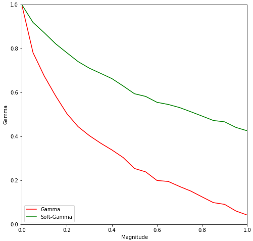
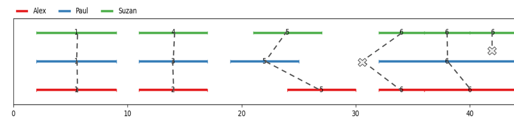
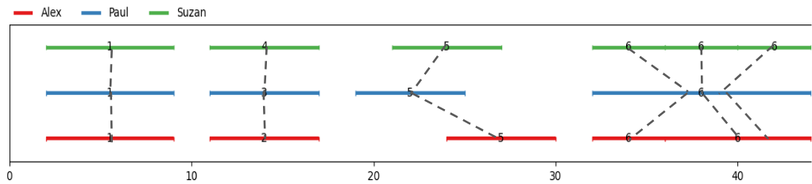

.. _softgamma:

========================================================
The Soft-Gamma-Agreement : an alternate measure to gamma
========================================================

To complete the gamma-agreement, we have added an option called "soft" gamma.
It is a small tweak to the measure created with the goal of doing exactly what gamma
does, except it reduces the disagreement caused by splits in annotations.

The idea behind this concept is to make use of the gamma agreement with machine learning models,
since most of the existing ones are prone to produce of lot more splitted annotations than human annotators.

How to use soft-gamma
~~~~~~~~~~~~~~~~~~~~~

The soft-gamma measure, for the user at least, works exactly like gamma :

.. code-block:: python

    continuum = pa.Continuum.from_csv("tests/data/AlexPaulSuzan.csv")
    dissim = pa.CombinedCategoricalDissimilarity(delta_empty=1,
                                                 alpha=0.75,
                                                 beta=0.25)
    gamma_results = continuum.compute_gamma(dissim, soft=True)

    print(f"gamma = {gamma_results.gamma}")
    pa.show_alignment(gamma_results.best_alignment)

The only difference will be the look of the resulting best alignment, as well as the gamma value.
This new gamma can be higher than the normal gamma (it is very unlikely to be lower).
The more splitted annotations the input continuum contains, the wider the differences between the two measures will be.

Here is a comparison of those two measures, with two types of errors generated by the corpus shuffling tool :

.. figure:: images/cmpsoftshift.png
  :scale: 64%
  :align: left

  **Shifted annotations, 3 annotators.**

  **Splitted annotations, 3 annotators.**

For **shifts**, a magnitude of :math:`p` means every start and end of unit is shifted by a random value
between :math:`0` and :math:`p \times l`, where :math:`l` is the duration of the unit.

For **splits**, a magnitude of :math:`p` means that for an annotator who has annotated :math:`n` segments,
:math:`p \times n \times 2` units are successively chosen at random to be split at a random time.
A unit can be splitted more than once.

As pointed before, the gamma-agreement is very sensitive to split annotations. Soft-gamma was created with the intent
of reducing the penalty of splits while keeping a similar value if none are involved.

What is soft-gamma ?
~~~~~~~~~~~~~~~~~~~~

This section will explain the differences between the two measures. Beware that it requires a bit of knowledge about the
gamma-agreement. You can learn more about it in the "Principles" section :

    "**A unitary alignment** is a tuple of `units`, each belonging to a unique annotator.
    For a given `continuum` containing annotations from ``n`` different annotators,
    the tuple will *have* to be of length ``n``. It represents a "match" (or the hypothesis of an agreement)
    between units of different annotators. A unitary alignment can contain `empty units`,
    which are "fake" (and null) annotations inserted to represent the absence of corresponding annotation
    for one or more annotators."

The main difference between soft-gamma and gamma is their definition of an **Alignment**, which the algorithms find the
best possible based on the dissimilarity measure.

for Gamma :
===========

"**An alignment** is a set of `unitary alignments` that constitute a *partition*
of a continuum. This means that each and every unit of each annotator from the partitioned continuum can be found
in the alignment **once, and only once**. "

To illustrate, let's visualize an alignment :

Every unit must be present **exactly** once, meaning splits create alignments with empty units,
resulting in an additionnal disorder cost of more than :math:`\Delta_\emptyset \times n` per split.

for Soft-Gamma :
================

"**A soft-alignment** is a set of `unitary alignments` that constitute a *superset*
of a continuum. This means that each and every unit of each annotator from the partitioned continuum can be found
in the alignment **at least once**."

To illustrate, let's visualize an alignment :

Every unit must be present **at least** once, meaning splits create multi-aligned units,
with significantly lower cost. Thus, this alignment will be preferred as the one before.

This definition ensures empty units are added to mark up a false negative and not to complete the partition
of the continuum with unitary alignments.

